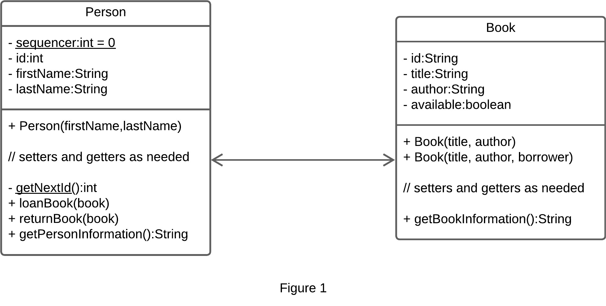

# OOP mini-project (Book Lender)

1. The simplified class diagram is part of a much larger program is shown in Figure 1 should be implemented.  
It is part of a book lender system where a person loans a book or more.  
In this program, each person needs to know all books that he or she has on landed,  
while each book only needs to know which person is currently having the book.  

>- Implement the class diagram provided in Figure 1.  
>- Create methods and attributes necessary for the functionality described below.  
>- Add additional methods and/or attributes as needed.  

### Class Diagram

### Covering
- [x] Git Branching.
- [x] Class diagram.
- [x] Association Relationship.
- [x] OOP Classes, Objects & Encapsulation
